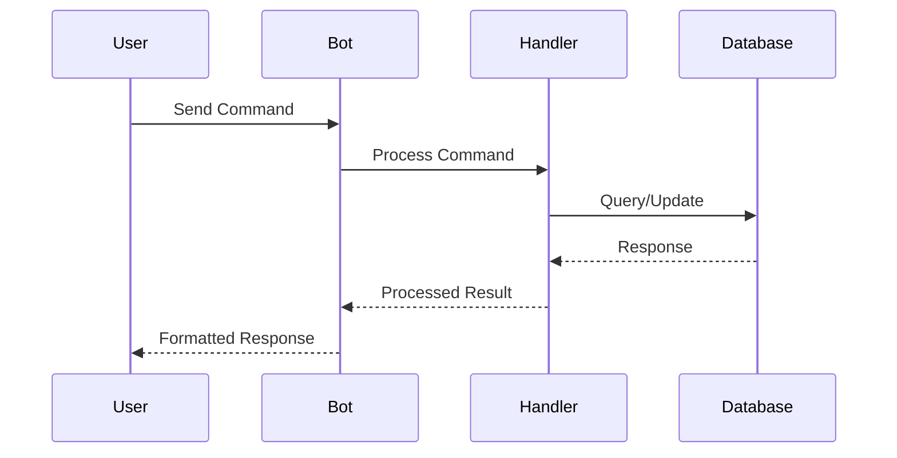
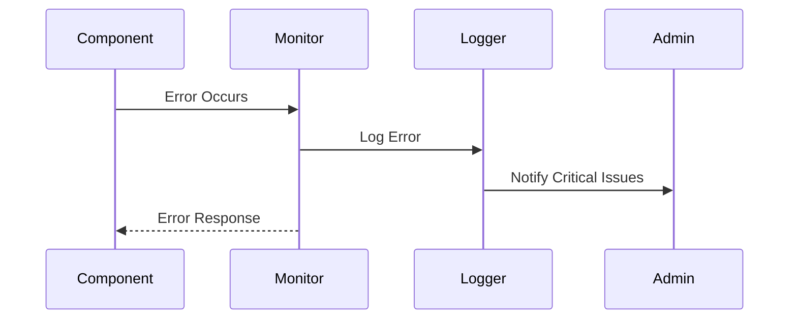

graph TD
    A[Telegram Bot Layer] --> B[Command Handler]
    B --> C[Business Logic Layer]
    C --> D[Data Access Layer]
    D --> E[PostgreSQL Database]
    A --> F[Monitoring System]
    F --> G[Health Metrics]
    F --> H[Error Logging]
```

### 1.2 Key Technologies
- Python 3.11+
- PostgreSQL Database
- Telegram Bot API
- SQLAlchemy ORM
- Flask Framework

## 2. Component Architecture

### 2.1 Bot Layer
```python
class TelegramBot:
    _instance = None
    _initialized = False
    _lock = asyncio.Lock()
```
- Implements Singleton pattern
- Manages bot lifecycle
- Handles command registration
- Implements connection pooling

### 2.2 Command Handler (handlers.py)
- Processes all bot interactions
- Implements rate limiting
- Manages user sessions
- Handles pagination

### 2.3 Database Layer
```python
app.config["SQLALCHEMY_ENGINE_OPTIONS"] = {
    "pool_recycle": 300,
    "pool_timeout": 20,
    "pool_pre_ping": True,
    "pool_size": 5,
    "max_overflow": 10
}
```
- Connection pooling
- Query optimization
- Transaction management

## 3. Data Flow Architecture

### 3.1 Request Flow


### 3.2 Error Handling Flow


## 4. Security Architecture

### 4.1 Application Security
- Rate limiting implementation
  ```python
  RATE_LIMIT_WINDOW = 60  # seconds
  MAX_REQUESTS = 10
  ```
- Credit system validation
- Admin authentication
- Input sanitization

### 4.2 Data Security
- Contact information encryption
- Secure credit transactions
- Database connection encryption
- API key management

### 4.3 Process Security
- File-based locking
- Process verification
- Proper cleanup procedures
- Error handling

## 5. Monitoring Architecture

### 5.1 System Health Monitoring
```python
def get_system_health(self) -> Dict[str, Any]:
    return {
        'uptime': time.time() - self.start_time,
        'memory_usage': process.memory_info().rss / 1024 / 1024,  # MB
        'cpu_percent': process.cpu_percent(),
        'thread_count': process.num_threads(),
        'open_files': len(process.open_files()),
        'connections': len(process.connections())
    }
```

### 5.2 Database Health Monitoring
```python
def check_database_health(self) -> Dict[str, bool]:
    pool_stats = {
        'size': pool.size(),
        'checkedin': pool.checkedin(),
        'overflow': pool.overflow(),
        'checkedout': pool.checkedout()
    }
```

## 6. Scalability Architecture

### 6.1 Current Implementation
- Connection pooling
- Rate limiting
- Process management
- Caching strategies

### 6.2 Future Scaling Points
- Redis integration for caching
- Load balancing capabilities 
- Horizontal scaling preparation
- Microservices architecture potential

## 7. Error Handling & Monitoring

### 7.1 Error Management
- Comprehensive logging
- Retry mechanisms
- Graceful degradation
- User feedback system

### 7.2 Monitoring
- Process health checks
- Database connection monitoring
- Rate limit tracking
- Performance metrics

## 8. Development Environment

### 8.1 Environment Setup
```bash
Required Environment Variables:
- TELEGRAM_TOKEN
- DATABASE_URL
- FLASK_SECRET_KEY